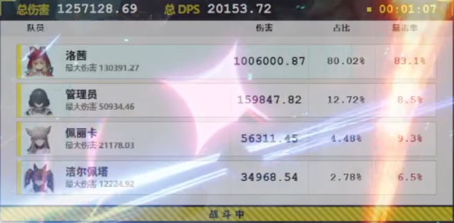
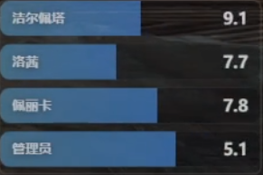
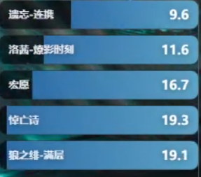
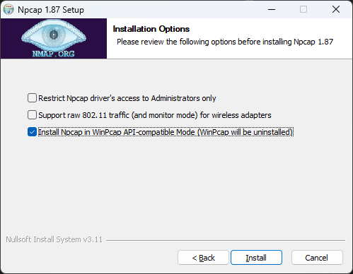

# ZMDLogs

基于NpCup抓包分析的《明日方舟：终末地》战斗分析工具

> [!CAUTION]
> 在使用本项目时，请时刻注意保护您珍贵的账号，详见下方 [安全使用](#安全使用) 章节

> [!Warning]
> 本项目包含大量和AI左右脑互搏而生成的的屎山，请在能力优秀的AI陪同下观看源码，保护身心健康。

### 目录

- [安全使用](#安全使用)
- [关于](#关于)
- [安装与使用](#安装与使用)
- [从源码构建](#从源码构建)
- [局限性](#局限性)
- [参考](#参考)
- [隐私声明](#隐私声明)
- [许可、商标、授权](#许可、商标、授权)

## 安全使用
本项目只监听游戏客户端与战斗服务器的数据流，监听发生在网卡层，没有对网络包进行任何修改，更没有注入、读取、修改游戏内存，也没有修改本地文件，最大化程度降低了影响和被检测的可能。即使如此，在您录制或发布截图时，请使用本工具的UID遮挡悬浮窗 **遮住游戏内的UID** ，不建议您捕捉悬浮窗到直播画面，避免可能存在的风险。

由于监听数据流的局限，本工具存在一些无法解决的问题，详见下方 [局限性](#局限性) 章节。

## 关于

ZMDLogs是一个为玩家在《明日方舟：终末地》内提供战斗信息统计的工具，本工具提供以下悬浮窗，如果您有自定义悬浮窗的需求，也可以添加其他HTML悬浮窗。

- 伤害统计



- 连携冷却监控



- BUFF监控



## 安装与使用

### 依赖

本工具依赖[Npcup](https://npcap.com/#download)，您可以从[官网](https://npcap.com/#download)下载，或者使用[Releases](https://github.com/deepdarkssj/ZMDLogs/releases)里的安装包。安装时请只勾选 Install Npcap in WinPcap API-compatible Mode



### 下载与安装

在本项目的[Releases](https://github.com/deepdarkssj/ZMDLogs/releases)下载`EndfieldLogs.zip`，如果您没有安装Npcup，也需要下载并安装`npcap-1.87.exe`，下载后解压到任意目录。

### 使用

- 为了捕获数据流，您需要先运行`EndfieldLogs.exe`，再开启游戏客户端，如果有正在运行的游戏，请您先退出游戏后再运行本程序。

- 启动后如果提醒 **错误：没有找到游戏安装目录** ，请手动选择游戏目录，您应该选择 `Endfield.exe` 所在的文件夹，它一般在启动器目录下，例如`Hypergryph Launcher/games/Endfield Game`

- 确认解析服务运行中后，您就可以开启游戏客户端了。初次使用时悬浮窗可能会堆叠在一起，您可以把他们拖动到合适的位置，之后在悬浮窗栏内开启`锁定位置`和`鼠标穿透`来锁定悬浮窗，您还可以为悬浮窗设置一个合适的透明度，避免遮挡您的游戏画面。

## 从源码构建

在试图从源码构建前，您需要获得两个缺失的文件：

- RSA_KEY（供解析网络包使用）
- 角色头像（供伤害统计悬浮窗使用）

本项目不涉及如何获取它们的内容。

### 依赖

运行时至少要满足其中一种：

- 在程序目录放置 `rsa_keys.txt`
- 放置 `src/endfieldlogs/embedded_keys.py`

如果需要显示头像，您还需要
- `icon/`

在项目根目录执行：

```powershell
python -m venv .venv
.\.venv\Scripts\python.exe -m pip install -r requirements.txt
```

前端开发还需要：

- Node.js
- npm

### 启动 GUI

```powershell
$env:PYTHONPATH='src'
.\.venv\Scripts\python.exe -m endfieldlogs gui
```

### 仅启动后台服务

```powershell
$env:PYTHONPATH='src'
.\.venv\Scripts\python.exe -m endfieldlogs serve --no-overlay
```

### 调试模式

```powershell
$env:PYTHONPATH='src'
.\.venv\Scripts\python.exe -m endfieldlogs serve --debug --no-overlay
```

### 前端开发

项目包含三套主要前端：

- `overlay/`
- `overlay_comboskill/`
- `overlay_buff/`

开发模式示例：

```powershell
cd overlay
npm install
npm run dev
```

调试时建议同时启动后台服务：

```powershell
$env:PYTHONPATH='src'
.\.venv\Scripts\python.exe -m endfieldlogs serve --no-overlay
```

前端默认通过本地 WebSocket 连接：

- `ws://127.0.0.1:29325/ws`

构建前端：

```powershell
cd overlay
npx vite build

cd ..\overlay_comboskill
npx vite build

cd ..\overlay_buff
npx vite build
```

## 局限性

由于抓包分析有力所不能及的区域，本项目包含以下已知缺陷无法修复，请不要反馈这些问题：

- BUFF/连携监控有延迟
- 大招时停播动画时BUFF监控依然在倒数，技能释放后才时停
- 角色的战斗资源难以监控（例如莱万汀、汤汤、庄方宜）

## 参考

[AKEData Wiki](https://www.akedata.top/)

## 隐私声明

本项目及项目自带悬浮窗对网络包的处理均在本地完成，不会存储到任何服务器，也不收集统计数据。
但您添加的悬浮窗具有对您战斗数据的完全访问能力，对于其他来源（非本仓库提供）的悬浮窗，请自行甄别其安全性。

## 许可、商标、授权

ZMDLogs 基于 MIT 许可开源

本项目所使用的图标版权归 `上海鹰角网络科技有限公司` 所有。
